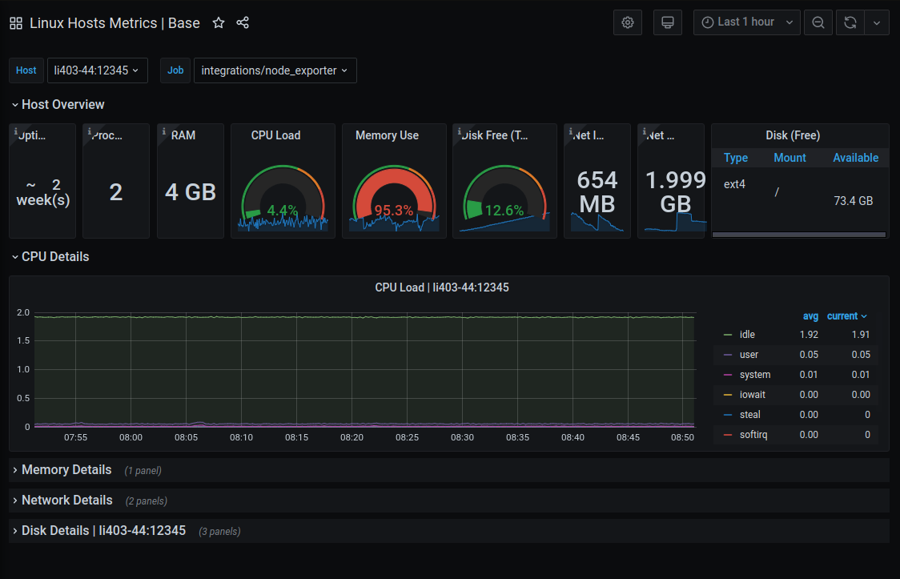
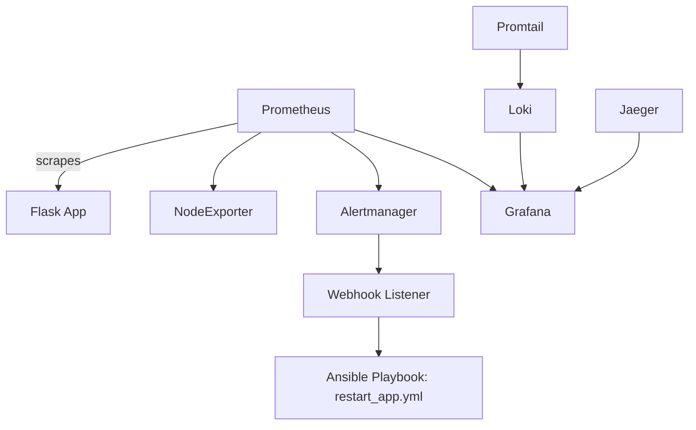

# 🚀 Self-Healing Infrastructure with Observability (Prometheus + Grafana + Loki + Jaeger + Ansible)

This project implements a **complete monitoring and self-healing DevOps stack** using containerized microservices. It showcases a robust **observability pipeline** (metrics, logs, traces) and a **self-recovery system** that reacts to system failures or threshold breaches in real-time.

Built with:  
**Prometheus, Grafana, Loki, Promtail, Jaeger, Alertmanager, Ansible, Flask, Docker, and Docker Compose**

Key features:
- 📈 Real-time system & app metrics (Prometheus + Grafana)
- 📬 Smart alerting & auto-remediation via Ansible
- 📜 Centralized logging using Loki + Promtail
- 🧵 Distributed tracing with Jaeger
- ⚙️ All services containerized and orchestrated via Docker Compose

---

## 📸 Project Screenshot



---

## 🧱 Project Architecture



---

## 📂 Folder Structure

```
infra-guardian/
├── app/                      # Flask app with metrics & tracing
│   ├── app.py
│   ├── requirements.txt
│   └── Dockerfile
│
├── monitoring/
│   ├── prometheus.yml
│   ├── alert_rules.yml
│   ├── alertmanager.yml
│   ├── loki-config.yaml
│   └── promtail-config.yml
│
├── ansible/
│   ├── inventory
│   └── restart_app.yml
│
├── Dockerfile.webhook       # For webhook container
├── docker-compose.yml
├── screenshots/
│   ├── grafana-dashboard.png
│   ├── setup observability.webp
│   ├── firing.png
│   └── resolved.png
└── README.md
```

---

## 🛠️ Tools Used

* **Docker + Docker Compose** – containerized environment
* **Prometheus** – metrics collection
* **Grafana** – dashboarding and visualization
* **Loki + Promtail** – log aggregation
* **Jaeger** – distributed tracing
* **Alertmanager** – alert routing
* **Webhook Listener** – custom Flask service
* **Ansible** – automation for self-healing

---

## 🚀 How to Run the Project

```bash
git clone https://github.com/Ayush2005547/infra-guardian.git
cd infra-guardian
docker-compose up --build
```

Then access:

* App: [http://localhost:5000](http://localhost:5000)
* Prometheus: [http://localhost:9090](http://localhost:9090)
* Grafana: [http://localhost:3000](http://localhost:3000)
* Alertmanager: [http://localhost:9093](http://localhost:9093)
* Jaeger UI: [http://localhost:16686](http://localhost:16686)

---

## ✅ Workflow Summary

1. Prometheus scrapes metrics from App and Node Exporter.
2. Alertmanager fires alert on threshold breach.
3. Webhook listener receives alert → triggers Ansible playbook.
4. Ansible restarts the Docker container.
5. Logs and traces are recorded using Loki & Jaeger.
6. Grafana shows real-time dashboards for metrics, logs & traces.

---

## 📈 Sample Alerts Configured

* High CPU Usage (>80%)
* Instance Down
* App Unresponsive

---

## 📊 Grafana Dashboards Include:

* CPU, RAM, Disk (from Node Exporter)
* Application Uptime & Metrics
* Real-time Logs (from Loki)
* Tracing Visuals (from Jaeger)

---

## 📄 License

MIT License. Fork freely and adapt!

---

## 👨‍💻 Authors

* Ayush Ahirwar

---

